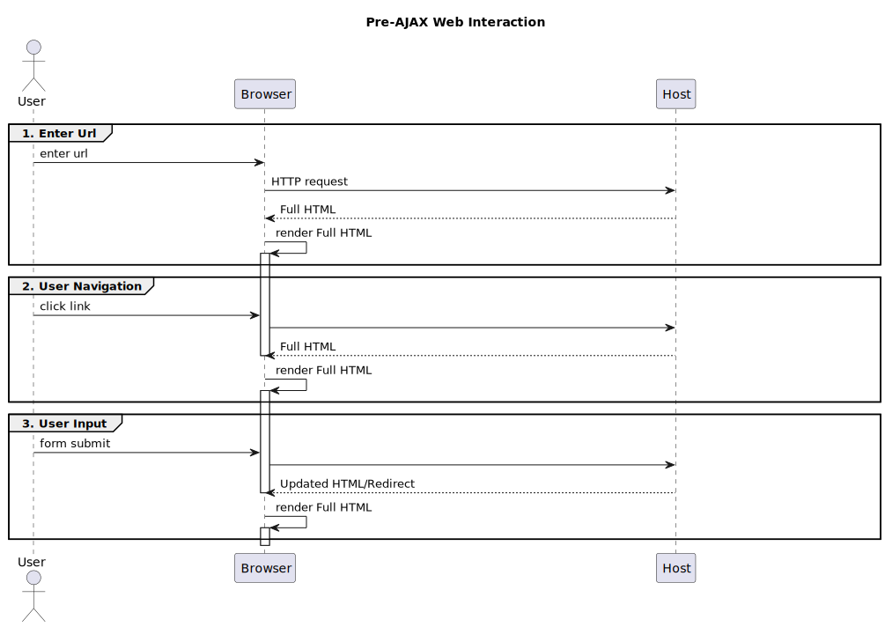
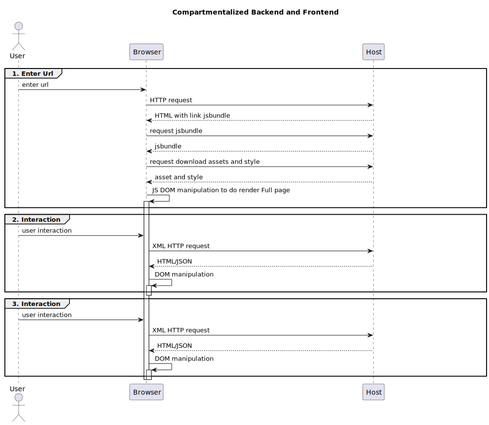
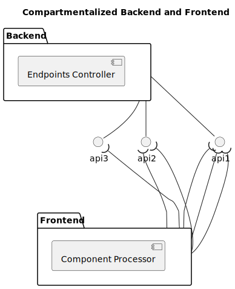
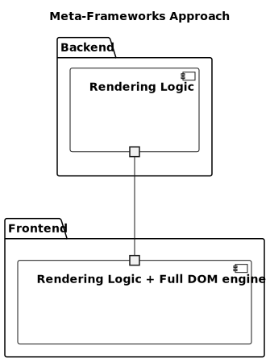
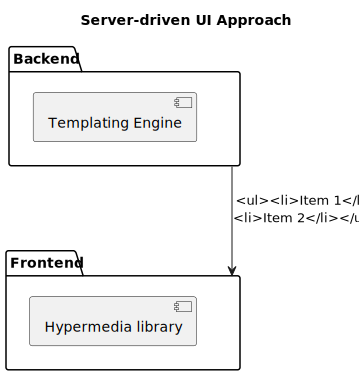

# Make Fullstack Web Development Great Again: HTMX
## About Me
- I Gusti Ngurah Adhi Baskara Putra
- Software Engineer
- Strength Training
- Philosophy (Metaphysics)
## Inspiration
- DHH's post "Merchant of Complexity"
- HTMX memes
- Personal discomfort with the current state of web development
## A Brief History of Web Development
- Single pages with links
- Forms for data input
- Early AJAX
- JQuery AJAX Programming Unification
- Backend and Frontend Compartmentalization
- Fullstack Renaissance
## Decadence of JavaScript Request
### Pre-AJAX

### AJAX (at least the promise of it)

### Backend and Frontend Compartmentalization

## Fullstack Approaches
### Compartmentalized Backend and Frontend approach

Client Only JavaScript frameworks or libraries and API-sytle backend endpoints.
Problems:
- need more developer hours
- more complexities
### Meta-frameworks Approach

Putting DOM generator in a server and produces HTML.
Problems:
- JavaScript on server
- Meta-frameworks don't produce HTML directly but through DOM simulator
### Server-driven UI Approach

Server generates HTML and sends it to the client just like the old days.
Problems:
- Some complicated user interactions are hard to achieve.
Reason to choose Server-driven UI Approaches:
- It's more practical to use the server as sources of truth
- Most business logic is already in the server
- Most business problems can be solved this way
- Suitable for Backend first developer
## HTMX (Basic Example)
Initial HTML
```
!DOCTYPE html>
<html lang="en">
<head>
    <meta charset="UTF-8">
    <meta name="viewport" content="width=device-width, initial-scale=1.0">
    <title>Todos</title>
    <script src="https://cdn.jsdelivr.net/npm/htmx.org@2.0.8/dist/htmx.min.js"></script>
</head>
<body>
<ul id="todos">
        <li>todo1</li>
        <li>todo2</li>
</ul>
<form hx-post="/todos"
      hx-target="#todos"
      hx-swap="outerHTML">
    <input type="text" name="newTodo">
    <button type="submit">Add</button>
</form>
</body>
</html>

```
Response from server
```
<ul id="todos">
        <li>todo1</li>
        <li>todo2</li>
        <li>todo3</li>
</ul>
```
## HTMX (Basic Example) Links
- clone https://github.com/ngurahbas/sboothtmxdemo
-  ./gradlew clean bootRun and open http://localhost:8080/todos
## HTMX (Advanced Example)
- clone https://github.com/ngurahbas/kanban or access https://kanban.baskara.net